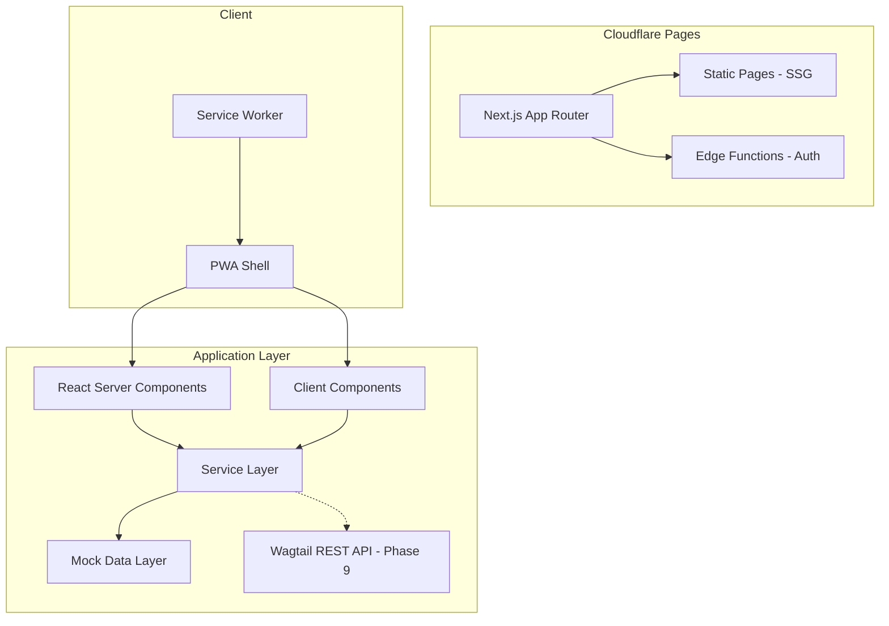
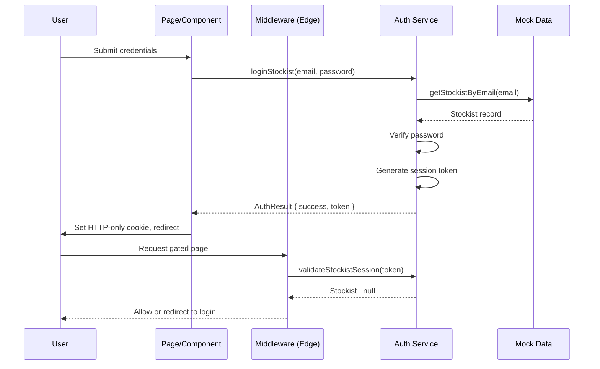

# Design Document — SI Crafts Website

## Overview

SI Crafts is a wholesale platform for Solomon Islands handicrafts, built as a Next.js App Router application with TypeScript. The site serves three audiences: public visitors (cultural storytelling, no pricing), stockists (wholesale ordering), and admins (content management). The hero feature is a "meet the maker" provenance flow where QR codes on product tags link to mobile-first story pages.

The architecture follows a mock-first, service-layer pattern: all data access flows through `/src/services/`, currently backed by typed mock data in `/src/data/mock/`. This single swap point allows future migration to a Wagtail REST API without modifying any page or component code.

Key constraints: no public pricing anywhere, consent gating at the service layer (only makers with signed consent appear publicly), cultural review flags on sensitive content, KISS principles throughout, and mobile-first responsive design.

## Architecture

### High-Level Architecture



### Architectural Principles

1. **Mock-first** — Entire site built on typed mock data. No external APIs, databases, or payment gateways until Phase 9.
2. **Service-layer as single swap point** — Pages/components call service functions; service functions import from mock data. Swapping to Wagtail means changing only service files.
3. **Static pre-rendering** — All public pages are statically generated at build time. Only auth-dependent pages use edge functions.
4. **Edge functions for auth** — Stockist and admin authentication handled at the edge (Cloudflare Pages Functions) for fast session validation without a full server runtime.
5. **Consent gating at service layer** — The service layer enforces consent/published checks. No unpublished maker data ever reaches a page component.
6. **Progressive enhancement** — Core content works without JS. Interactivity (filters, cart, animations) layers on top.

### Tech Stack

| Layer | Technology |
|-------|-----------|
| Framework | Next.js 14+ (App Router, TypeScript, Turbopack) |
| Styling | Tailwind CSS 3.4+ |
| Components | shadcn/ui + Radix UI primitives |
| Icons | Lucide React |
| Animation | Framer Motion (respects prefers-reduced-motion) |
| Deployment | Cloudflare Pages |
| PWA | next-pwa / custom service worker |
| Images | next/image with Cloudflare Image Resizing |

### Folder Structure

```
/app/                          → Next.js App Router routes
  (public)/                    → Public route group (statically generated)
  (stockist)/                  → Stockist-gated route group
  (admin)/                     → Admin-gated route group
/src/
  components/                  → Reusable UI components
    layout/                    → Header, Footer, MobileNav, SkipLink
    cards/                     → MakerCard, ProductCard, CraftCard
    catalogue/                 → ProductGrid, GroupToggle, MakerFilter, SearchInput
    provenance/                → PieceSection, MakerSection, CraftSection, PlaceSection, WhereToBuy
    forms/                     → LoginForm, StockistApplicationForm, ContactForm, OrderForm
    admin/                     → AdminSidebar, CRUDTable, MediaUpload, ConsentToggle, CulturalReviewFlag
    shared/                    → Badge, Button, Dialog, Toast
  data/mock/                   → Typed mock data files
  services/                    → Service layer (sole data access point)
  theme/                       → Design tokens (colours, spacing, typography)
  types/                       → Shared TypeScript type definitions
  lib/                         → Utility functions and helpers
/public/
  icons/                       → PWA icons (192px, 512px)
  manifest.json                → PWA manifest
```

## Route Map

### Public Routes (Static, SSG)

| Route | Description |
|-------|-------------|
| `/` | Home page — hero, featured products, makers preview, crafts highlight |
| `/catalogue` | Product catalogue — filterable, searchable, grouped by material/type |
| `/makers` | Meet the Makers index — alphabetical cards of published makers |
| `/maker/[slug]` | Maker detail — story, portrait, products grid |
| `/craft/[slug]` | Craft technique detail — description, process images, linked makers/products |
| `/piece/[product-code]` | Provenance page — the hero "meet the maker" QR destination |
| `/p/[product-code]` | Redirect → `/piece/[product-code]` (short URL for QR codes) |
| `/about` | About page — Solomon Islands, SIAC team, mission |
| `/wholesale` | Wholesale explainer — process, no pricing, login/apply links |
| `/contact` | Contact page — form + email |
| `/our-promise` | Promise/values page |
| `/crafts-and-techniques` | Footer page — overview of three craft categories |
| `/care-guide` | Footer page — material-specific care instructions |
| `/faqs-and-shipping` | Footer page — FAQ entries covering ordering, delivery, returns, retail |

### Stockist Routes (Gated — requires stockist auth)

| Route | Description |
|-------|-------------|
| `/stockist/login` | Stockist login form |
| `/stockist/catalogue` | Wholesale catalogue with pricing visible |
| `/stockist/orders` | Draft order builder + submit |
| `/stockist/order-history` | Past order requests list |
| `/stockist/apply` | Stockist application form (public, no auth required) |

> Note: `/stockist/apply` is publicly accessible (no auth). All other `/stockist/*` routes require an authenticated stockist session.

### Admin Routes (Gated — requires admin auth)

| Route | Description |
|-------|-------------|
| `/admin/login` | Admin login form |
| `/admin/dashboard` | Admin dashboard — overview, quick stats |
| `/admin/makers` | CRUD for maker records |
| `/admin/products` | CRUD for product records |
| `/admin/crafts` | CRUD for craft records |
| `/admin/stockists` | Manage stockist accounts + applications |
| `/admin/orders` | View/manage order requests |
| `/admin/team` | Team/editor management |
| `/admin/admins` | Super-admin only — manage admin accounts |

## Components and Interfaces

### Layout Components

| Component | File | Props | Responsibility |
|-----------|------|-------|----------------|
| `Header` | `layout/header.tsx` | none | Primary nav (6 links), logo, responsive collapse |
| `Footer` | `layout/footer.tsx` | none | 3 content boxes, social links, copyright |
| `MobileNav` | `layout/mobile-nav.tsx` | `isOpen, onClose` | Hamburger menu panel, focus trap |
| `SkipLink` | `layout/skip-link.tsx` | none | Skip-to-main-content for accessibility |

### Card Components

| Component | File | Props | Responsibility |
|-----------|------|-------|----------------|
| `MakerCard` | `cards/maker-card.tsx` | `maker: Maker` | Portrait, name, village, craft — links to /maker/[slug] |
| `ProductCard` | `cards/product-card.tsx` | `product: Product, showPrice?: boolean` | Photo, name, code, material, maker — links to /piece/[code] |
| `CraftCard` | `cards/craft-card.tsx` | `craft: Craft` | Image, name, short description — links to /craft/[slug] |

### Catalogue Components

| Component | File | Props | Responsibility |
|-----------|------|-------|----------------|
| `ProductGrid` | `catalogue/product-grid.tsx` | `products: Product[], showPrice?: boolean` | Responsive grid of ProductCards |
| `GroupToggle` | `catalogue/group-toggle.tsx` | `activeGroup, onChange` | Toggle between material/type grouping |
| `MakerFilter` | `catalogue/maker-filter.tsx` | `makers: Maker[], selected, onChange` | Dropdown filter by maker |
| `SearchInput` | `catalogue/search-input.tsx` | `value, onChange, maxLength: 200` | Search field with debounce |

### Provenance Components

| Component | File | Props | Responsibility |
|-----------|------|-------|----------------|
| `PieceSection` | `provenance/piece-section.tsx` | `product: Product` | Product name, photo, code, materials, care |
| `MakerSection` | `provenance/maker-section.tsx` | `maker: Maker \| null` | Maker name, portrait, story excerpt (≤300 chars) |
| `CraftSection` | `provenance/craft-section.tsx` | `craft: Craft` | Technique name, link to full craft page |
| `PlaceSection` | `provenance/place-section.tsx` | `maker: Maker` | Island/province, cultural context (if reviewed) |
| `WhereToBuy` | `provenance/where-to-buy.tsx` | none | Link to wholesale enquiry page |

### Form Components

| Component | File | Props | Responsibility |
|-----------|------|-------|----------------|
| `LoginForm` | `forms/login-form.tsx` | `onSubmit, error?` | Email + password, generic error display |
| `StockistApplicationForm` | `forms/stockist-application-form.tsx` | `onSubmit` | Business name, ABN, contact, description |
| `ContactForm` | `forms/contact-form.tsx` | `onSubmit` | Name, email, message with validation |
| `OrderForm` | `forms/order-form.tsx` | `cart, onSubmit` | Order review, GST warning, bank transfer notice |

### Admin Components

| Component | File | Props | Responsibility |
|-----------|------|-------|----------------|
| `AdminSidebar` | `admin/admin-sidebar.tsx` | `role: AdminRole` | Navigation, role-conditional items |
| `CRUDTable` | `admin/crud-table.tsx` | `columns, data, onEdit, onDelete` | Generic data table with actions |
| `MediaUpload` | `admin/media-upload.tsx` | `onUpload, accept, maxSize` | File upload (JPEG/PNG/WebP, ≤5MB) |
| `ConsentToggle` | `admin/consent-toggle.tsx` | `maker, onChange` | Consent status + published flag linkage |
| `CulturalReviewFlag` | `admin/cultural-review-flag.tsx` | `flagStatus, onChange` | Toggle reviewed/unreviewed on cultural content |

### Shared Components

| Component | File | Props | Responsibility |
|-----------|------|-------|----------------|
| `Badge` | `shared/badge.tsx` | `variant, children` | Status badges (approved, pending, shipped) |
| `Button` | `shared/button.tsx` | `variant, size, ...` | shadcn/ui button wrapper |
| `Dialog` | `shared/dialog.tsx` | `open, onClose, children` | Confirmation dialogs (delete actions) |
| `Toast` | `shared/toast.tsx` | `message, type` | Success/error notifications |

## Data Models

All types defined in `/src/types/` and used by both mock data and service layer.

```typescript
// /src/types/maker.ts
export type ConsentStatus = 'Signed' | 'Not Signed';

export interface Maker {
  id: string;
  slug: string;
  name: string;                    // Real name, never generic
  village: string;
  province: string;
  island: string;
  portraitUrl: string | null;      // null → use neutral placeholder
  story: string | null;            // First-person voice; null → "pending cultural review"
  storyCulturalReviewFlag: CulturalReviewStatus;
  craftId: string;                 // Primary craft technique
  consentStatus: ConsentStatus;
  publishedFlag: boolean;          // Derived from consentStatus at service layer
  createdAt: string;               // ISO 8601
  updatedAt: string;
}

// /src/types/craft.ts
export interface Craft {
  id: string;
  slug: string;                    // "pandanus-weaving" | "wood-carving" | "shell-money-jewellery"
  name: string;                    // Display name
  description: string;             // Technique description (≥1 paragraph)
  processImageUrls: string[];      // At least 1 image
  culturalContext: string | null;  // Ceremonial/cultural info
  culturalContextReviewFlag: CulturalReviewStatus;
  materialCategory: MaterialCategory;
}

// /src/types/product.ts
export type MaterialCategory = 'pandanus' | 'wood' | 'shells';
export type ProductType = 'bags' | 'jewellery' | 'trays' | 'fans' | 'bowls' | 'ornaments' | 'baskets';

export interface Product {
  id: string;
  productCode: string;             // Pattern: {P|W|S}-{A-Z+}-{integer}
  name: string;
  description: string;
  materialCategory: MaterialCategory;
  productType: ProductType;
  makerId: string;
  craftId: string;
  imageUrls: string[];             // Gallery; empty → dignified placeholder
  dimensions: string | null;       // e.g. "30cm × 20cm × 10cm"
  careNotes: string | null;
  wholesalePrice: number;          // AUD, never shown to public
  publishedFlag: boolean;          // Derived: true only if linked maker is published
  createdAt: string;
  updatedAt: string;
}

// /src/types/stockist.ts
export type StockistStatus = 'pending' | 'approved' | 'rejected';

export interface Stockist {
  id: string;
  businessName: string;
  abn: string;                     // 11 digits
  contactName: string;
  email: string;
  phone: string;
  description: string;             // Max 500 chars
  status: StockistStatus;
  passwordHash: string;            // Mock: plaintext for dev
  createdAt: string;
  updatedAt: string;
}

// /src/types/admin.ts
export type AdminRole = 'super_admin' | 'editor';

export interface AdminUser {
  id: string;
  name: string;
  email: string;
  role: AdminRole;
  passwordHash: string;            // Mock: plaintext for dev
  isActive: boolean;
  failedLoginAttempts: number;
  lockedUntil: string | null;      // ISO 8601 or null
  createdAt: string;
  updatedAt: string;
}

// /src/types/order.ts
export type OrderStatus = 'Submitted' | 'Confirmed' | 'Shipped';

export interface CartItem {
  productId: string;
  productCode: string;
  productName: string;
  quantity: number;                 // 1–999
  unitPrice: number;               // AUD wholesale
}

export interface OrderRequest {
  id: string;
  referenceNumber: string;         // Unique, generated on submission
  stockistId: string;
  items: CartItem[];
  totalAud: number;                // Sum of (qty × unitPrice), 2 decimal places
  status: OrderStatus;
  submittedAt: string;             // ISO 8601
  notes: string | null;
}

// /src/types/contact.ts
export interface ContactSubmission {
  id: string;
  name: string;
  email: string;
  message: string;
  submittedAt: string;
}

// /src/types/common.ts
export type CulturalReviewStatus = 'unreviewed' | 'reviewed';

// /src/types/stock-shop.ts
export interface StockShop {
  id: string;
  name: string;
  location: string;
  url: string | null;
}
```

## Design Tokens

Design tokens live in `/src/theme/` and are consumed via Tailwind CSS configuration.

### Colour Palette

```typescript
// /src/theme/colours.ts
export const colours = {
  // Warm neutrals
  sand:        { light: '#F5F0E8', DEFAULT: '#E8DFD0', dark: '#C4B8A5' },
  terracotta:  { light: '#D4845A', DEFAULT: '#C06A3A', dark: '#9C4F28' },
  cream:       '#FFFDF8',
  warmGray:    { 100: '#F7F5F2', 200: '#EDE9E3', 400: '#B8AFA3', 600: '#7A7067', 800: '#4A433B' },

  // Ocean blues
  ocean:       { light: '#5B9EAF', DEFAULT: '#2E7D8C', dark: '#1A5C6A' },
  teal:        { light: '#7EC8C8', DEFAULT: '#4AA8A8', dark: '#2D7A7A' },
  deepBlue:    '#1B3A4B',

  // Functional
  white:       '#FFFFFF',
  black:       '#1A1A1A',
  success:     '#2D7A4F',
  warning:     '#C4882A',
  error:       '#B83A3A',

  // Backgrounds
  pageBg:      '#FFFDF8',        // Warm off-white
  cardBg:      '#FFFFFF',
  footerBg:    '#1B3A4B',        // Deep blue
};
```

### Typography

```typescript
// /src/theme/typography.ts
export const typography = {
  fontFamily: {
    body: ['Inter', 'system-ui', 'sans-serif'],
    heading: ['Playfair Display', 'Georgia', 'serif'],
  },
  fontSize: {
    xs:   '0.75rem',   // 12px
    sm:   '0.875rem',  // 14px
    base: '1rem',      // 16px — minimum body size
    lg:   '1.125rem',  // 18px
    xl:   '1.25rem',   // 20px
    '2xl': '1.5rem',   // 24px
    '3xl': '1.875rem', // 30px
    '4xl': '2.25rem',  // 36px
    '5xl': '3rem',     // 48px
  },
  lineHeight: {
    body: '1.6',       // ≥1.5 as required
    heading: '1.2',
    relaxed: '1.75',
  },
  fontWeight: {
    normal: '400',
    medium: '500',
    semibold: '600',
    bold: '700',
  },
};
```

### Spacing

```typescript
// /src/theme/spacing.ts
export const spacing = {
  base: '4px',         // 4px base unit
  xs:   '4px',         // 1 unit
  sm:   '8px',         // 2 units
  md:   '16px',        // 4 units
  lg:   '24px',        // 6 units — minimum section gap
  xl:   '32px',        // 8 units
  '2xl': '48px',       // 12 units
  '3xl': '64px',       // 16 units
  '4xl': '96px',       // 24 units
  section: '24px',     // Minimum between content sections (requirement 22.5)
  sectionLg: '48px',   // Larger section gaps on desktop
};
```

### Breakpoints

```typescript
// /src/theme/breakpoints.ts — maps to Tailwind defaults
export const breakpoints = {
  sm:  '640px',
  md:  '768px',       // Hamburger collapse threshold
  lg:  '1024px',
  xl:  '1280px',
};
```

### Shadows and Radii

```typescript
// /src/theme/effects.ts
export const shadows = {
  sm:   '0 1px 2px rgba(0, 0, 0, 0.05)',
  md:   '0 4px 6px rgba(0, 0, 0, 0.07)',
  lg:   '0 10px 15px rgba(0, 0, 0, 0.1)',
  card: '0 2px 8px rgba(0, 0, 0, 0.06)',
};

export const radii = {
  sm:   '4px',
  md:   '8px',
  lg:   '12px',
  xl:   '16px',
  full: '9999px',
};
```

## Service Layer API

All service functions in `/src/services/`. Each function currently imports from `/src/data/mock/` and will later call the Wagtail REST API.

### Makers Service (`/src/services/makers.ts`)

```typescript
// Public (consent-gated — only returns published makers)
getPublicMakers(): Promise<Maker[]>
getPublicMakerBySlug(slug: string): Promise<Maker | null>
getMakersBycraft(craftId: string): Promise<Maker[]>

// Admin (all makers regardless of consent)
getAllMakers(): Promise<Maker[]>
getMakerById(id: string): Promise<Maker | null>
createMaker(data: CreateMakerInput): Promise<Maker>
updateMaker(id: string, data: UpdateMakerInput): Promise<Maker | null>
deleteMaker(id: string): Promise<boolean>
setConsentStatus(id: string, status: ConsentStatus): Promise<Maker | null>
```

### Products Service (`/src/services/products.ts`)

```typescript
// Public (excludes products linked to unpublished makers)
getPublicProducts(filters?: ProductFilters): Promise<Product[]>
getPublicProductByCode(productCode: string): Promise<Product | null>
getProductsByMaker(makerId: string): Promise<Product[]>
searchProducts(query: string): Promise<Product[]>

// Stockist (includes pricing)
getWholesaleProducts(filters?: ProductFilters): Promise<Product[]>

// Admin
getAllProducts(): Promise<Product[]>
getProductById(id: string): Promise<Product | null>
createProduct(data: CreateProductInput): Promise<Product>
updateProduct(id: string, data: UpdateProductInput): Promise<Product | null>
deleteProduct(id: string): Promise<boolean>
validateProductCode(code: string): boolean
```

### Crafts Service (`/src/services/crafts.ts`)

```typescript
getAllCrafts(): Promise<Craft[]>
getCraftBySlug(slug: string): Promise<Craft | null>
getCraftById(id: string): Promise<Craft | null>
createCraft(data: CreateCraftInput): Promise<Craft>
updateCraft(id: string, data: UpdateCraftInput): Promise<Craft | null>
deleteCraft(id: string): Promise<boolean>
```

### Stockists Service (`/src/services/stockists.ts`)

```typescript
getStockistById(id: string): Promise<Stockist | null>
getStockistByEmail(email: string): Promise<Stockist | null>
getAllStockists(): Promise<Stockist[]>
createApplication(data: StockistApplicationInput): Promise<Stockist>
approveStockist(id: string): Promise<Stockist | null>
rejectStockist(id: string): Promise<Stockist | null>
```

### Admin Service (`/src/services/admins.ts`)

```typescript
getAdminById(id: string): Promise<AdminUser | null>
getAdminByEmail(email: string): Promise<AdminUser | null>
getAllAdmins(): Promise<AdminUser[]>
createAdmin(data: CreateAdminInput): Promise<AdminUser>
updateAdmin(id: string, data: UpdateAdminInput): Promise<AdminUser | null>
deactivateAdmin(id: string, requestingAdminId: string): Promise<AdminUser | null>
incrementFailedLogin(id: string): Promise<void>
resetFailedLogin(id: string): Promise<void>
lockAccount(id: string, until: string): Promise<void>
```

### Orders Service (`/src/services/orders.ts`)

```typescript
createOrderRequest(stockistId: string, items: CartItem[]): Promise<OrderRequest>
getOrdersByStockist(stockistId: string): Promise<OrderRequest[]>
getOrderById(id: string): Promise<OrderRequest | null>
getAllOrders(): Promise<OrderRequest[]>
updateOrderStatus(id: string, status: OrderStatus): Promise<OrderRequest | null>
generateReferenceNumber(): string
```

### Auth Service (`/src/services/auth.ts`)

```typescript
// Stockist auth
loginStockist(email: string, password: string): Promise<AuthResult>
logoutStockist(sessionToken: string): Promise<void>
validateStockistSession(sessionToken: string): Promise<Stockist | null>

// Admin auth
loginAdmin(email: string, password: string): Promise<AuthResult>
logoutAdmin(sessionToken: string): Promise<void>
validateAdminSession(sessionToken: string): Promise<AdminUser | null>

// Shared types
interface AuthResult {
  success: boolean;
  sessionToken?: string;
  error?: string;          // Generic "Invalid credentials" only
  lockedUntil?: string;    // If account locked
}
```

### Contact Service (`/src/services/contact.ts`)

```typescript
submitContactForm(data: ContactFormInput): Promise<ContactSubmission>
getAllSubmissions(): Promise<ContactSubmission[]>
```

### Filter Types

```typescript
interface ProductFilters {
  materialCategory?: MaterialCategory;
  productType?: ProductType;
  makerId?: string;
  search?: string;         // Case-insensitive substring match on name + description
}
```

## Authentication Architecture

### Overview

Two separate authentication flows: Stockist and Admin. Both use session-based auth with secure HTTP-only cookies. During mock development, auth is simulated with in-memory session storage.



### Stockist Auth

- **Login**: `/stockist/login` — email + password → session cookie → redirect to `/stockist/catalogue`
- **Session**: HTTP-only, Secure, SameSite=Strict cookie; 8-hour inactivity timeout
- **Logout**: Destroys session, clears cookie, redirects to `/wholesale`
- **Protection**: Middleware on `/stockist/*` (except `/stockist/apply` and `/stockist/login`) validates session before rendering
- **Invalid credentials**: Single generic message "Invalid email or password" (never reveals which field)

### Admin Auth

- **Login**: `/admin/login` — email + password → session cookie → redirect to `/admin/dashboard`
- **Session**: HTTP-only, Secure, SameSite=Strict cookie; 60-minute inactivity timeout, 24-hour absolute timeout
- **Lockout**: After 5 consecutive failed attempts for same email, account locked for 15 minutes
- **Logout**: Destroys session, clears cookie, redirects to `/admin/login`
- **Protection**: Middleware on `/admin/*` (except `/admin/login`) validates session and role
- **Role gating**: Editor sessions cannot access `/admin/admins`; Super_Admin sessions have full access

### Role-Based Access Control

```typescript
type Permission = 
  | 'makers:crud'
  | 'products:crud'
  | 'crafts:crud'
  | 'stockists:manage'
  | 'orders:manage'
  | 'admins:manage';    // Super_Admin only

const rolePermissions: Record<AdminRole, Permission[]> = {
  super_admin: ['makers:crud', 'products:crud', 'crafts:crud', 'stockists:manage', 'orders:manage', 'admins:manage'],
  editor: ['makers:crud', 'products:crud', 'crafts:crud', 'orders:manage'],
};
```

### Mock Auth (Development)

During Phases 0–8, auth is simulated:
- Passwords stored as plaintext in mock data (not hashed)
- Sessions stored in an in-memory Map (cleared on server restart)
- Session tokens generated with `crypto.randomUUID()`
- No real encryption — purely functional simulation

### Security Constraints (Production Readiness)

When migrating to Wagtail (Phase 9):
- Passwords hashed with bcrypt
- Sessions backed by signed JWTs or server-side store
- CSRF protection on all mutation endpoints
- Rate limiting on login endpoints
- Secure session rotation on privilege changes

## Correctness Properties

*A property is a characteristic or behavior that should hold true across all valid executions of a system — essentially, a formal statement about what the system should do. Properties serve as the bridge between human-readable specifications and machine-verifiable correctness guarantees.*

### Property 1: Open Graph Tags Valid on All Public Pages

*For any* public page route, the rendered HTML SHALL include og:title (≤60 characters), og:description (≤155 characters), og:image (non-empty URL), and og:url (non-empty URL).

**Validates: Requirements 1.8, 20.9**

### Property 2: Service Returns Null for Unknown Identifier

*For any* string identifier that does not match an existing record, calling a single-entity service function (getMakerById, getProductByCode, getCraftBySlug, etc.) SHALL return `null` without throwing an error.

**Validates: Requirements 2.5**

### Property 3: Product Codes Valid and Unique

*For any* product in the dataset, its productCode SHALL match the pattern `^[PWS]-[A-Z]+-\d+$` and no two products SHALL share the same productCode.

**Validates: Requirements 2.6, 16.7**

### Property 4: Filter AND Logic

*For any* combination of active filter parameters (materialCategory, productType, makerId), every product returned by the filter function SHALL satisfy ALL active filter criteria simultaneously. When a maker filter is applied, all results belong to that specific maker.

**Validates: Requirements 2.7, 5.3**

### Property 5: Search Returns Case-Insensitive Substring Matches

*For any* search term, every product returned by the search function SHALL contain that term as a case-insensitive substring in either its name or description field. When no products match, an empty array is returned.

**Validates: Requirements 2.8**

### Property 6: Public Makers Consent Gating

*For any* maker returned by a public-facing service function, that maker's consentStatus SHALL be "Signed" AND publishedFlag SHALL be true. No maker with consentStatus "Not Signed" or publishedFlag false SHALL ever appear in public results.

**Validates: Requirements 2.9, 6.2, 18.1**

### Property 7: Public Products Exclude Unpublished-Maker Products

*For any* product returned by a public-facing service function, its associated maker SHALL have publishedFlag = true. Products linked to unpublished or non-consented makers SHALL never appear in public listings, search results, or catalogue views.

**Validates: Requirements 2.10, 5.9**

### Property 8: No Pricing for Unauthenticated Users

*For any* product displayed to an unauthenticated user (on any public page including catalogue, provenance, or home), the rendered output SHALL NOT contain any wholesale price, RRP, or price indicator.

**Validates: Requirements 5.6, 10.4**

### Property 9: Product Card Required Fields

*For any* product rendered as a card component, the output SHALL include: product name, product code, photograph (or dignified placeholder), material category, product type, and associated maker name.

**Validates: Requirements 5.7**

### Property 10: Product Detail Required Fields

*For any* product rendered on its detail/provenance page, the output SHALL include: image gallery (or placeholder), product code, material category, product type, dimensions (if available), care notes (if available), and linked maker name.

**Validates: Requirements 5.10**

### Property 11: Makers Index Alphabetical Sort

*For any* pair of adjacent makers in the public makers index list, the first maker's name SHALL be alphabetically less than or equal to the second maker's name, and all makers in the list SHALL have publishedFlag = true.

**Validates: Requirements 6.1**

### Property 12: No Generic Identity-Erasing Phrases

*For any* maker-related content rendered on a public page, the output text SHALL NOT contain the phrases "skilled artisan", "local craftsperson", "traditional maker", or "traditional community" as substitutes for a maker's real identity.

**Validates: Requirements 6.6, 18.2**

### Property 13: Provenance Page Five Sections in Order

*For any* valid product with a published maker, the provenance page at `/piece/{product-code}` SHALL render exactly five sections in order: "This Piece", "Your Maker", "The Craft", "The Place", "Where to Buy".

**Validates: Requirements 8.2**

### Property 14: Unreviewed Cultural Content Not Rendered Publicly

*For any* content field with a Cultural_Review_Flag set to "unreviewed", that content SHALL NOT be displayed on any public-facing page. A "pending cultural review" placeholder or the section without narrative SHALL be shown instead.

**Validates: Requirements 8.9, 18.4**

### Property 15: Authenticated Stockist Sees Pricing

*For any* product viewed while a stockist session is active and valid, the rendered output SHALL include wholesale pricing information.

**Validates: Requirements 11.3**

### Property 16: Unauthenticated Redirect from Stockist-Gated Routes

*For any* stockist-gated route (excluding /stockist/apply and /stockist/login), a request without a valid stockist session SHALL result in a redirect to the stockist login page without exposing any pricing or order data.

**Validates: Requirements 11.6**

### Property 17: Cart State Consistency

*For any* sequence of add, adjust-quantity, and remove operations on a draft order, the resulting cart state SHALL be internally consistent: all quantities are between 1 and 999 inclusive, no duplicate productIds exist, and removed items are absent from the cart.

**Validates: Requirements 13.1**

### Property 18: Cart Total Equals Sum of Line Items

*For any* cart state containing one or more items, the displayed total SHALL equal the sum of (quantity × unitPrice) for all line items, rounded to exactly 2 decimal places.

**Validates: Requirements 13.2**

### Property 19: GST Warning Threshold

*For any* cart total value, the GST threshold warning SHALL be visible if and only if the total exceeds A$1,000.

**Validates: Requirements 13.3**

### Property 20: Order History Sorted Descending

*For any* pair of adjacent order requests in a stockist's order history, the first order's submittedAt timestamp SHALL be greater than or equal to the second order's submittedAt timestamp.

**Validates: Requirements 13.5**

### Property 21: Editor Denied Admin-Management Routes

*For any* admin-management route (/admin/admins), a request with an Editor session SHALL be denied access and the editor SHALL be redirected to the admin dashboard with an "insufficient permissions" message.

**Validates: Requirements 15.5, 15.6**

### Property 22: Non-Admin Redirect from Admin Routes

*For any* /admin/* route (except /admin/login), a request from a non-admin user (unauthenticated, stockist, or public visitor) SHALL be redirected to the public home page without revealing that an admin area exists.

**Validates: Requirements 15.7**

### Property 23: Consent Status and Published Flag Linkage

*For any* maker, when consentStatus is set to "Signed" the publishedFlag SHALL become true, and when consentStatus is set to "Not Signed" the publishedFlag SHALL become false. This linkage SHALL be enforced at the service layer.

**Validates: Requirements 16.3, 16.4**

### Property 24: Product Code Validation

*For any* string input to the product code validator, the function SHALL accept the string if and only if it matches the pattern where the first character is P, W, or S, followed by a hyphen, followed by one or more uppercase letters, followed by a hyphen, followed by a positive integer.

**Validates: Requirements 16.7, 16.8**

### Property 25: New Maker Content Defaults to Unreviewed

*For any* newly created maker record, the Cultural_Review_Flag on story content SHALL default to "unreviewed" until an admin explicitly marks it as reviewed.

**Validates: Requirements 18.8**

## Error Handling

### Strategy

Error handling follows a layered approach: service layer catches and normalizes errors, pages render appropriate user-facing messages, and the system fails gracefully without exposing internals.

### Service Layer Errors

| Scenario | Service Behavior | Page Behavior |
|----------|-----------------|---------------|
| Entity not found | Return `null` | Render "not found" with navigation link |
| Invalid filter/search | Return empty array `[]` | Show "no results" message with clear-filters prompt |
| Auth failure | Return `{ success: false, error: "Invalid credentials" }` | Display generic error, never reveal which field failed |
| Account locked | Return `{ success: false, lockedUntil }` | Show "account locked" with time remaining |
| Validation failure | Throw `ValidationError` with field details | Display inline errors per field |
| Product code invalid | Return `false` from validator | Inline error showing expected format |
| Permission denied | Throw `PermissionError` | Redirect to appropriate page + message |
| Self-deactivation | Throw `BusinessRuleError` | Show "cannot deactivate own account" message |

### Client-Side Error States

- **Network offline**: PWA service worker serves offline shell with "You are offline" message and cached navigation
- **404 pages**: Custom not-found page with navigation back to relevant section
- **Form validation**: Inline errors linked via `aria-describedby`, announced via `aria-live="assertive"`
- **Cart operations**: Optimistic UI with rollback on failure, toast notification for errors
- **Session expired**: Redirect to login with "session expired" message

### Error Response Patterns

```typescript
// Service layer error types
class ValidationError extends Error {
  constructor(public fields: Record<string, string>) { super('Validation failed'); }
}

class PermissionError extends Error {
  constructor(public requiredRole: AdminRole) { super('Insufficient permissions'); }
}

class BusinessRuleError extends Error {
  constructor(message: string) { super(message); }
}
```

### Security-Sensitive Error Handling

- Auth errors never distinguish between "user not found" and "wrong password"
- Admin route access by non-admins redirects to home (not a 403 page that reveals admin exists)
- Failed login attempts are counted per-email for lockout, but the user only sees generic messages
- No stack traces, internal IDs, or system details in any user-facing error

## Testing Strategy

### Overview

The testing strategy uses a dual approach: property-based tests for universal correctness guarantees, and example-based unit/integration tests for specific scenarios and edge cases.

### Property-Based Testing

**Library**: [fast-check](https://github.com/dubzzz/fast-check) (TypeScript, integrates with Vitest)

**Configuration**:
- Minimum 100 iterations per property test
- Each property test tagged with: `Feature: si-crafts-site, Property {N}: {title}`
- Tests run against the service layer with mock data

**Properties to implement** (from Correctness Properties section above):
- Properties 2–7: Service layer data integrity (consent gating, filtering, search, null returns, product codes)
- Properties 8, 15: Auth-dependent rendering (no pricing / show pricing)
- Properties 11, 12, 20: Sort ordering and content constraints
- Properties 17–19: Cart logic (state consistency, total calculation, GST threshold)
- Properties 23–25: Admin business rules (consent linkage, code validation, review flag defaults)

### Unit Tests (Vitest)

**Focus areas**:
- Component rendering: verify required fields present in output
- Form validation: email format, ABN 11 digits, required fields, max lengths
- Route protection: middleware redirects for unauthenticated access
- Edge cases: unknown product codes (404), makers with no products, missing portraits
- Auth flows: login success/failure, logout, session expiry, account lockout

**Example-based tests for specific scenarios**:
- Home page renders hero, featured products, makers preview
- Provenance page shows "maker details pending" for unpublished maker
- Provenance page shows "piece not found" for invalid code
- Contact form submission success/failure paths
- Stockist application validation (ABN format, required fields)
- Admin CRUD operations per entity type
- Super admin self-deactivation rejection

### Integration Tests

**Focus areas**:
- Full page rendering with mock data (SSG output)
- Route navigation flows (catalogue → product detail → provenance)
- Auth flow end-to-end (login → access gated content → logout → redirect)
- Cart flow (add items → adjust → submit → confirmation)

### Accessibility Testing

- Automated: axe-core via `@axe-core/react` or Lighthouse CI
- Manual verification: keyboard navigation, screen reader announcements, focus management
- Colour contrast: verified via design tokens (all combinations ≥4.5:1 for body text)

### Performance Testing

- Lighthouse CI in GitHub Actions for public pages (target: score ≥90)
- Core Web Vitals monitoring: LCP < 3s on simulated 3G for provenance pages

### Test File Organization

```
/tests/
  unit/
    services/           → Service layer property + unit tests
    components/         → Component rendering tests
    lib/                → Utility function tests
  integration/
    flows/              → Multi-page user flow tests
    auth/               → Authentication flow tests
  properties/           → Property-based tests (fast-check)
```

## Key Design Decisions

### 1. Mock-First Architecture

**Decision**: Build entire site on typed mock data before any CMS integration.

**Rationale**: Decouples front-end development from CMS availability. Allows full UX validation, testing, and deployment without backend dependencies. Mock data enforces type contracts that the real API must fulfill.

### 2. Service Layer as Single Swap Point

**Decision**: All data access through `/src/services/`. Pages never import from `/src/data/mock/`.

**Rationale**: When Wagtail is ready, only service files change. No page or component modifications. The service layer also enforces business rules (consent gating, published flag checks) regardless of data source.

### 3. Static Pre-Rendering for Public Pages

**Decision**: All public pages generated at build time (SSG). Only auth-dependent pages use edge functions.

**Rationale**: Maximum performance on Cloudflare Pages CDN. Public content doesn't change per-request. Provenance pages (QR scan targets) load instantly from edge cache, meeting the 3-second 3G requirement.

### 4. Edge Functions for Authentication

**Decision**: Auth validation runs as Cloudflare Pages Functions (edge middleware), not full server-side rendering.

**Rationale**: Fast session validation without cold starts. No Node.js server runtime needed. Keeps deployment simple on Cloudflare Pages.

### 5. Cultural Review Flag System

**Decision**: Cultural content carries a `CulturalReviewStatus` field. Unreviewed content is never rendered publicly.

**Rationale**: Respects Solomon Islands cultural sovereignty. Prevents accidental publication of sensitive cultural narratives before review by cultural partners. Enforcement at service layer means no component can bypass it.

### 6. Consent Gating Enforcement at Service Layer

**Decision**: The service layer filters out non-consented makers at query time. Public-facing functions never return unpublished data.

**Rationale**: Defense in depth. Even if a page component has a bug, it physically cannot receive unpublished maker data. The consent→published flag linkage is automatic and bidirectional.

### 7. Separate Auth Flows (Stockist vs Admin)

**Decision**: Independent login pages, session stores, and middleware for stockists and admins.

**Rationale**: Different security requirements (8h vs 60min timeout, lockout rules). Prevents privilege confusion. Admin area completely hidden from non-admin users (no 403 pages that reveal its existence).

### 8. Cart Persistence via Local Storage

**Decision**: Draft orders persist in browser localStorage, not server-side.

**Rationale**: Survives page navigation and refresh without server calls. Simple implementation. Cart is per-browser, per-stockist session. Cleared on successful submission.

### 9. Product Code Validation at Service Layer

**Decision**: Product code pattern validation is a service-layer function, not just a form-level regex.

**Rationale**: Ensures consistency whether codes are created via admin UI, bulk import, or future API. Single source of truth for the validation rule.

### 10. No Public Pricing — Enforced at Multiple Levels

**Decision**: Pricing data excluded from public service functions, not just hidden in UI.

**Rationale**: Defense in depth. The `getPublicProducts()` function strips pricing. Even if a component rendered all fields, no price data would be present. The `ProductCard` component additionally has a `showPrice` prop defaulting to false.
